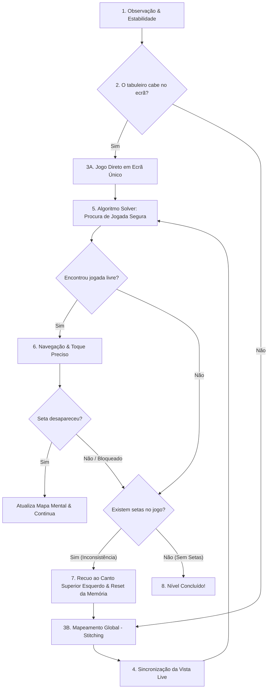

# Raciocínio e Ciclo de Decisão do Bot (Loop Principal)

Este documento descreve a **lógica de raciocínio e tomada de decisão** do **Auto-ARROWS**, detalhando a perspetiva de "pensamento" do bot em cada fase do ciclo de jogo, em vez de uma lista descritiva de funções.

---

## 1. Visão Geral da Filosofia do Bot

O raciocínio do bot assenta em três pilares fundamentais:
1. **Segurança Absoluta (Anti-Penalização)**: O bot é extremamente conservador. Prefere não jogar a arriscar um toque numa seta bloqueada (o que perderia uma vida no jogo).
2. **Modelo Mental Discreto**: O bot não decide toques com base em intuição visual direta; ele traduz o mundo em uma matriz simbólica discreta (grelha de células vazias, ocupadas e cabeças com direção).
3. **Resiliência e Auto-Correção**: Se a realidade do ecrã divergir do mapa mental (por exemplo, quando fica sem jogadas com setas ainda no tabuleiro), o bot reconhece o erro, limpa a memória e reconstrói o mapa do zero.

---

## 2. O Raciocínio Passo a Passo (O Ciclo de Vida do Raciocínio)

---

### Fase 1: Percepção e Estabilidade
> *"Antes de pensar ou agir, preciso de garantir que o ecrã está quieto."*

- **O Raciocínio**: O bot tira duas capturas de ecrã consecutivas com um pequeno intervalo de tempo.
- **Decisão**: Se houver diferença entre as imagens (animações de setas a sair, efeitos visuais ou transições de nível), ele aguarda. Só avança quando a imagem for 100% estática.

---

### Fase 2: Avaliação do Escopo do Tabuleiro
> *"Este tabuleiro cabe no meu ecrã ou é um mapa gigante?"*

- **O Raciocínio**: O bot analisa os limites do conteúdo das setas no ecrã.
- **Decisão**:
  - **Se o tabuleiro cabe todo no ecrã**: Ativa o modo de jogo direto (rápido).
  - **Se as setas cortam as bordas do ecrã**: O tabuleiro é maior do que a vista. O bot ativa o modo de **Construção de Mapa Mental Global**.

---

### Fase 3: Construção do Mapa Mental Global (*Stitching*)
> *"Vou navegar por todo o ecrã para desenhar o mapa completo do tabuleiro."*

- **O Raciocínio**:
  1. O bot desloca-se até ao **canto superior esquerdo** do tabuleiro.
  2. Executa uma varredura ordenada em grelha (esquerda $\rightarrow$ direita, desce uma faixa, direita $\rightarrow$ esquerda).
  3. Reduz cada frame visual a uma matriz simbólica:
     - `.` = Célula vazia.
     - `#` = Corpo de seta / obstáculo.
     - `^`, `v`, `<`, `>` = Cabeça de seta e sua direção.
     - `?` = Zona desconhecida (fora do ecrã).
  4. Alinha as peças e funde-as num **mapa mental global**.

---

### Fase 4: Sincronização de Posição
> *"Onde é que a minha câmara do telemóvel está a apontar no mapa neste momento?"*

- **O Raciocínio**: Em tabuleiros gigantes, a câmara só mostra uma fração da grelha.
- **Decisão**: O bot compara a captura live com o seu mapa mental para determinar com precisão em que célula `(linha, coluna)` do mapa se encontra o centro da vista atual.

---

### Fase 5: Algoritmo de Decisão (*Solver*)
> *"Quais das setas do meu mapa mental têm caminho 100% livre para sair?"*

- **O Raciocínio**: Para cada cabeça de seta conhecida no mapa:
  1. O bot projeta uma "linha de visão" reta a partir da cabeça na direção apontada, até atingir o limite externo do tabuleiro.
  2. Analisa cada célula ao longo desse caminho retilíneo.
- **Regra de Decisão**:
  - Se encontrar `#` (outra seta) $\rightarrow$ **Bloqueada**.
  - Se encontrar `?` (zona desconhecida) $\rightarrow$ **Bloqueada (por segurança)**.
  - Se todas as células até à borda forem `.` (vazias) $\rightarrow$ **Jogada Válida e Segura!**

---

### Fase 6: Navegação Otimizada e Toque Preciso
> *"Se a seta já está visível na zona segura do ecrã, toco nela imediatamente. Não perco tempo a centralizá-la!"*

- **O Raciocínio**:
  1. O bot verifica se a cabeça da seta jogável já se encontra na **zona visível e segura** do ecrã (fora das barras de UI superior e inferior).
  2. **Toque Imediato Otimizado**: Se a seta já estiver dentro dos limites seguros do ecrã — mesmo que esteja perto das margens —, o bot **não precisa de a mover para o centro do ecrã**. Ele executa o toque diretamente de imediato.
  3. **Scroll Apenas se Necessário**: O bot apenas efetua deslizes (*swipes*) se a seta estiver completamente fora da vista atual ou escondida debaixo dos elementos da UI.
  4. Localiza a cabeça da seta na imagem real visível e executa o toque (`adb tap`) no centro exato da cabeça.

---

### Fase 7: Confirmação e Validação de Sucesso
> *"A seta realmente saiu do jogo depois do meu toque?"*

- **O Raciocínio**: O bot aguarda pela animação de saída e tira uma nova foto.
- **Decisão**:
  - **A seta desapareceu**: O bot atualiza o mapa mental (marca a posição como `.`) e continua para a próxima jogada.
  - **A seta NÃO desapareceu**:
    - O toque falhou ou o mapa mental ficou dessincronizado.
    - O bot incrementa o contador de falhas. Ao atingir 2 falhas ou ao ficar sem jogadas válidas com setas ainda no ecrã, ativa o **Mecanismo de Recuperação Autónoma**.

---

### Fase 8: Recuperação Autónoma (Reset e Limpeza de Memória)
> *"O meu mapa mental divergiu da realidade. Vou apagar tudo e mapear do zero."*

- **O Raciocínio**: Se o bot não encontra jogadas válidas mas deteta que ainda existem setas no jogo:
  1. Reconhece que a memória interna ou o alinhamento das grelhas foi corrompido.
  2. **Scroll de Emergência**: Navega automaticamente de volta ao **canto superior esquerdo** do tabuleiro.
  3. **Limpeza de Memória**: Apaga completamente todas as capturas, imagens e modelos temporários do disco (`imgs/frames/`, `imgs/grids/`, `imgs/stitching/`).
  4. **Reconstrução**: Executa um *stitching* novo do zero como se fosse um tabuleiro limpo com apenas as setas restantes.
  5. Retoma o loop de jogo com o novo mapa limpo.

---

### Fase 9: Conclusão do Nível
> *"Não restam cabeças de seta no mapa mental. Nível completado!"*

- **O Raciocínio**: Quando a lista de cabeças de setas fica vazia, o bot valida que o nível foi limpo com sucesso e aguarda pelo próximo nível.
